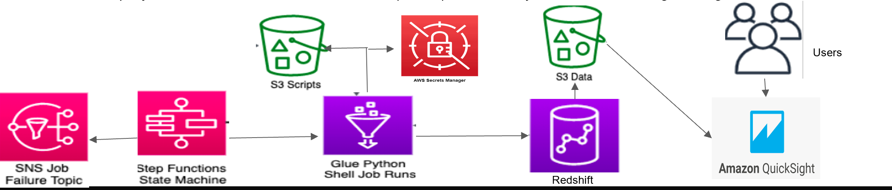
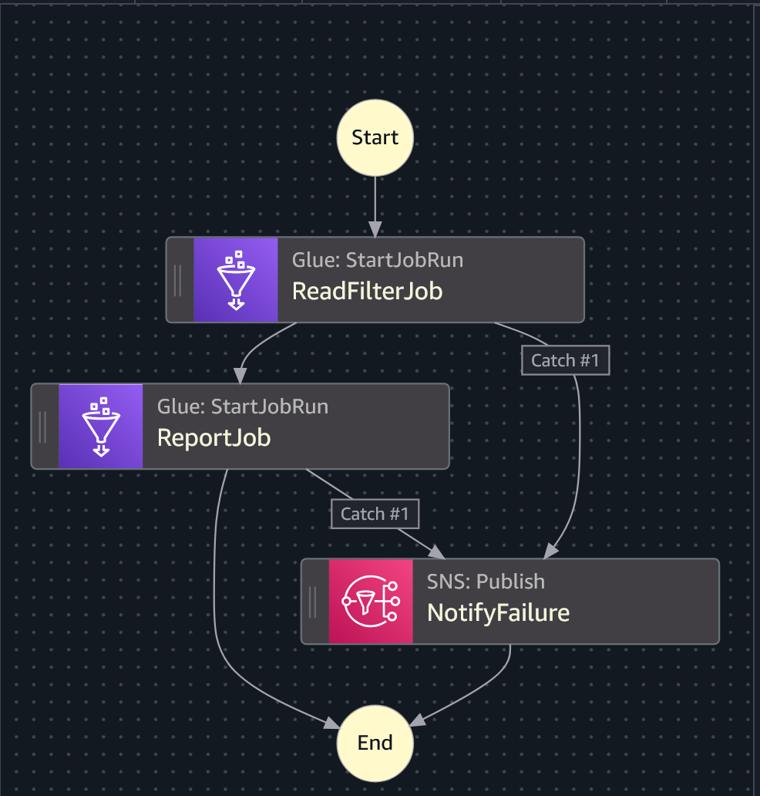

# Amazon Redshift ETL Orchestration Using Step Functions and Glue
This project demonstrates a robust and scalable ETL (Extract, Transform, Load) pipeline built on AWS, designed to process and analyze large datasets. Specifically, it focuses on managing Amazon reviews for products, partitioned by month and year, and orchestrating the ETL process using AWS Step Functions and AWS Glue. The processed data is then made available for analysis and visualization through Amazon Redshift and Amazon QuickSight.

## Project Overview
This project provides an end-to-end solution for building a scalable and automated ETL pipeline on AWS. It demonstrates how to leverage AWS Step Functions to orchestrate a series of AWS Glue Python Shell jobs, which in turn interact with Amazon Redshift and Amazon S3 to process and store data. The solution includes robust error handling and provides multiple avenues for data access and visualization. The primary dataset used for this project is Amazon product reviews, partitioned by month and year.

## Architecture Diagram
The following diagram illustrates the architecture of the ETL pipeline:

##Tech Stack
+ Language: Python3, SQL
+ Services: Amazon Redshift, AWS Glue, Amazon SNS, AWS Step Functions, Amazon S3, AWS Secrets Manager, Amazon QuickSight, AWS VPC
+ Libraries: boto3, sys
+ 
## Key Features
+ Automated ETL Workflow: Orchestration of ETL processes using AWS Step Functions and AWS Glue.
+ Secure Data Handling: Utilization of AWS Secrets Manager for database connection information and VPC for network isolation.
+ Scalable Data Processing: Leveraging Amazon Redshift for data warehousing and Redshift Spectrum for direct querying of S3 data.
+ Robust Error Handling: Integration with Amazon SNS for immediate failure notifications.
+ Flexible Data Access: Data accessible directly from Redshift or visualized via Amazon QuickSight.
+ Modular Glue Jobs: Python Shell jobs configured with parameters for reusability.

## Workflow Description
The core of this architecture is a state machine process that orchestrates a series of AWS Glue Python Shell jobs. Each Glue job is designed to be highly configurable, retrieving database connection details from AWS Secrets Manager and an SQL file from an S3 bucket.

The AWS Glue Python Shell jobs establish a connection with an Amazon Redshift cluster and execute the queries defined in the SQL files. Two primary tasks are performed within this architecture:

### Task 1: Data Loading
The Amazon Redshift cluster uses Amazon Redshift Spectrum to read raw review data directly from an S3 bucket. This external data is then loaded into an internal Amazon Redshift table within the cluster for efficient querying and analysis.

### Task 2: Data Aggregation and Export
After loading, the Redshift cluster executes an aggregation query. This query performs computations or analyses on the loaded data. The results of this aggregation are then exported to another designated location within Amazon S3 using the Redshift UNLOAD operation. These exported files serve as report outputs or sources for further analysis.

## Error Handling
In the event of a failure within the AWS data pipeline, the Step Functions state machine is configured to send a notification to an Amazon Simple Notification Service (SNS) topic. This ensures that relevant parties are immediately alerted to any issues, allowing for prompt investigation and resolution.

## Data Access and Visualization
Users have two primary methods to interact with the processed data and retrieve report output files:

  1. Direct Querying: Users can query the data directly from the Amazon Redshift cluster using SQL.
  2. Amazon QuickSight: For business intelligence and interactive visualization, users can access the report output files stored in S3 or the data within Redshift using Amazon QuickSight. QuickSight provides a user-friendly interface for creating dashboards, graphs, and charts to gain insights from the data.

## Setup and Deployment Steps
This section outlines the steps required to set up and deploy the project's infrastructure and components.

1. Setting up a VPC (Virtual Private Cloud)
To ensure the security and isolation of your infrastructure, begin by creating a VPC.

     + Create a VPC named "myprojectvpc".
     + Divide the network into two public subnets (Public subnet A and Public subnet B) and two private subnets (Private subnet A and Private subnet B).
     + Configure route tables, an internet gateway, NAT gateways, and appropriate security groups to control network traffic.

2. Create a Redshift Cluster
Set up your Redshift cluster, which will serve as the final data warehouse.

     + Select the US East - North Virginia region for consistency with the VPC.
     + Place the Redshift cluster in a private subnet of the VPC to enhance data security.
     + The cluster will eventually read data from S3 using Redshift Spectrum and load it into its tables.

3. Creating S3 Buckets Using the AWS CLI tool
Create S3 buckets to store necessary files, including ETL scripts and raw data.

    + Use the AWS CLI tool to create buckets. For example:(Note: Bucket names must be globally unique across all AWS.)

           aws s3 mb s3://redshift-scriptbucket261191

    + Upload your ETL scripts and other resources required by the Glue jobs to these buckets.

     
4. Creation and Execution of Glue Jobs
   
    Configure and deploy AWS Glue jobs for ETL processes.

     + In AWS Glue, add a new connection to your Redshift cluster. Test the connection to ensure it's working correctly.
     + Create an IAM role named "myglueIAM".
     + Create an IAM policy named "mygluepolicy" that grants "myglueIAM" the necessary permissions to access S3, Redshift, Secrets Manager, and other required AWS services.
     + Create your Glue Python Shell jobs. These jobs will:
       - Utilize the myglueIAM role and mygluepolicy.
       - Connect to Redshift using the defined Glue connection.
       - Retrieve SQL files from S3 and execute queries for data loading (Task 1) and aggregation/export (Task 2).
         
5. Creating an Amazon Simple Notification Service (SNS)
    Set up SNS for job failure notifications.

    + Create an SNS topic. This will serve as the communication channel for failure alerts.
    + Create a subscription for the SNS topic. Specify the protocol as email and provide an email address where notifications should be sent.
    + Important: Verify the email address to activate the subscription and enable notification delivery.
      
6. Creating and Implementing Step Functions
    Define and manage the workflow of your Glue jobs using Step Functions.

   

    + Create a new state machine within AWS Step Functions.
    + Define the workflow logic, visually representing the sequence and dependencies of your Glue jobs and other tasks.
    + Configure the state machine to trigger the Glue jobs sequentially or in parallel as needed.
    + Integrate the SNS topic into the state machine to send notifications upon job execution failures.
    + The Step Function will orchestrate the process of reading external tables (pointers to S3 data) created by Glue, and ensuring the reviews internal table in Redshift is populated. The output files in S3 from Task 2 will serve as a source for QuickSight.

8. Creating an Analysis Dashboard on QuickSight
    Visualize and analyze your data using Amazon QuickSight.

    + Connect Amazon QuickSight to your Amazon Redshift cluster.
    + Alternatively, connect QuickSight directly to the S3 bucket where aggregated report output files are stored.
    + Use QuickSight's drag-and-drop interface to create interactive dashboards, graphs, and charts to gain insights from your customer review data.

## Use Cases
Orchestrating Redshift ETL processes using AWS Glue and Step Functions offers several valuable use cases for efficient and scalable data processing workflows:

### Data Ingestion and Transformation
AWS Glue's ETL capabilities extract data from diverse sources, modify it to meet specific business needs, and load it into Amazon Redshift for analysis. Step Functions orchestrate the entire ETL workflow, ensuring orderly execution and handling errors or retries.

### Complex Data Transformations
Combining AWS Glue and Step Functions enables the orchestration of complex data transformations and enrichment. This includes data cleansing, aggregation, deduplication, and join operations across multiple datasets before loading the transformed data into Redshift.

### Scheduled Data Updates
Automate scheduled ETL processes by setting up Glue jobs to run at specific intervals. Step Functions define the sequence and dependencies between these jobs, ensuring correct execution order for regular data extraction, transformation, and loading into Redshift.

### Error Handling and Retry Mechanisms
AWS Glue and Step Functions allow the definition of robust error handling strategies for issues like network failures and data format problems. This ensures reliable ETL process execution, managing and recovering from failures effectively.

### Real-Time Data Streaming
Integrating AWS Glue with Redshift facilitates the effective capture and processing of real-time data streams. Glue can ingest and transform streaming data from various sources, which can then be loaded into Redshift for analysis. This integration enables near real-time insights, empowering timely business decisions.

## Learning Takeaways
Working on this project provides comprehensive hands-on experience and valuable insights into building robust data pipelines on AWS:

+ Core AWS Services: Grasp the functionalities and roles of essential components like AWS Glue, Redshift, S3, AWS Step Functions, Amazon SNS, and QuickSight in the ETL pipeline.
+ VPC Configuration: Understand how to create and configure a VPC to isolate and secure resources within the AWS cloud environment.
+ Redshift Cluster Management: Learn how to create and configure a Redshift cluster, and connect to it using the Amazon Redshift Query editor.
+ AWS Glue ETL: Gain hands-on experience creating AWS Glue jobs to perform ETL tasks on various data sources.
+ SNS Notifications: Understand how to create SNS topics and subscribe to them to receive notifications for critical events.
+ Step Functions Orchestration: Learn how to create and configure AWS Step Functions to orchestrate and coordinate complex ETL workflows.
+ Data Visualization with QuickSight: Gain knowledge of Amazon QuickSight and its capabilities for data visualization and analytics, transforming raw data into actionable insights.
